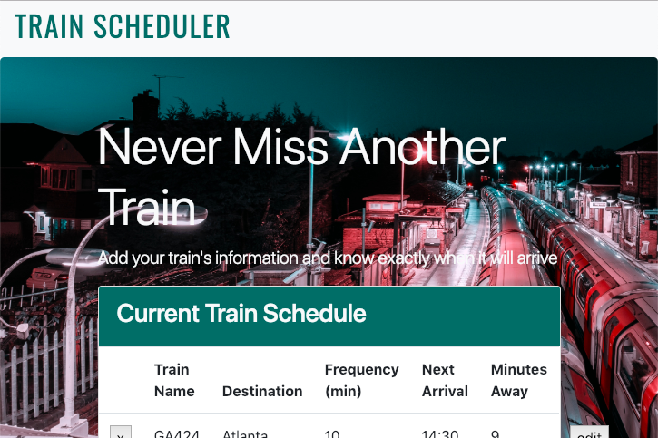

# Train-Scheduler

A train schedule application that incorporates Firebase to host arrival and departure data. The app retrieves and manipulates this information with Moment.js. The website provides up-to-date information about various trains, namely their arrival times and how many minutes remain until they arrive at their station.

## How it works 

Upon visiting the page the user can see which trains are currently in the schedule. The schedule displays the train name, destination, frequency(mins), next arrival, and minutes away. The user has the option to delete the train from the database or edit the train's information (destination, first train time, and frequency).

The user can also add a train to the database by entering the train name, destination, first train time, and frequency.

### visit the application below
https://willrackley.github.io/Train-Scheduler/

